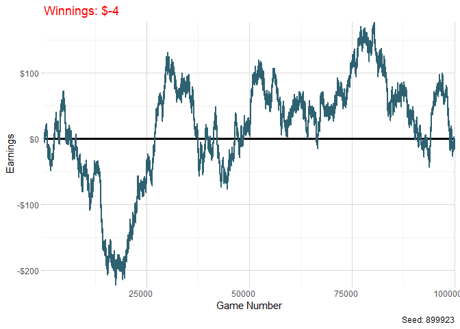

<style type="text/css">
h1, h4 {
  text-align: center;
}
</style>


# Introduction

I was first introduced to the [law of large numbers](https://en.wikipedia.org/wiki/Law_of_large_numbers) in college and was fascinated with how simple it can be understand, yet people will still gamble money expecting to win more than what they wager. Here I wrote a function that takes three parameters to help simulate a night of gambling. The parameters are `Number of games played`, `Probabiliy of winning a game` and `Cost to play a game`. I have this function randomly sample n amount of trials based on the `Number of games played` argument passed in our function. The output is a plot showing how your earnings converged throughout the night and your final earnings at the end of the night. I've included a randomly drawn seed for every plot also in case you are interested in recreating this random data with a certain seed that I set. 

If you have a 49% chance of winning a game, your earnings in the game may start off high or low. As you play more and more games, your earnings will start to converge negative infinity as shown below.

## Example of game with 49% chance of winning played

```r
game(
  num_games = 10000,
  win_probability = 0.49,
  money_per_game = 10,
  seed = 411864
)
```

<!-- -->

If you have a 50/50 chance of winning a game you should expect to be close to breaking even at the end of the night. It is very much possible that you will not have an earnings of 0$ but be very close at the end of the night.

## Example of game with 50% chance of winning played

```r
game(
  num_games = 10000,
  win_probability = 0.5,
  money_per_game = 10
)
```

<!-- -->


```r
plots = function(
  num_rows,
  num_cols,
  num_games,
  win_probability,
  money_per_game
){
  
  
# num_rows <- 2
# num_cols <- 3
num_plots <- num_rows * num_cols

# Specify seeds for each plot
seeds <- sample(1:1000000, num_plots)

# Create an empty list to store the plots
plots_list <- list()

# Generate plots for each seed
for (i in 1:num_plots) {
  current_seed <- seeds[i]
  current_plot <- game(
    num_games = num_games,
    win_probability = win_probability,
    money_per_game = money_per_game,
    seed = current_seed)
  plots_list[[i]] <- current_plot
}
return(grid.arrange(grobs = plots_list, ncol = 3))
}
```

# Grid of examples with Law of Large Numbers

```r
plots(
  num_rows = 3,
  num_cols = 3,
  num_games = 1000,
  win_probability = .49,
  money_per_game = 10
  )
```

<!-- -->

# Game Simualtions

## Slots

```r
plots(
  num_rows = 2,
  num_cols = 3,
  num_games = 500,
  win_probability = .1,
  money_per_game = 1
  )
```

<!-- -->

## Poker

```r
plots(
  num_rows = 2,
  num_cols = 3,
  num_games = 20,
  win_probability = .4,
  money_per_game = 5
  )
```

<!-- -->

<!-- ## Crabs -->

```r
plots(
  num_rows = 2,
  num_cols = 3,
  num_games = 20,
  win_probability = .4,
  money_per_game = 5
  )
```
